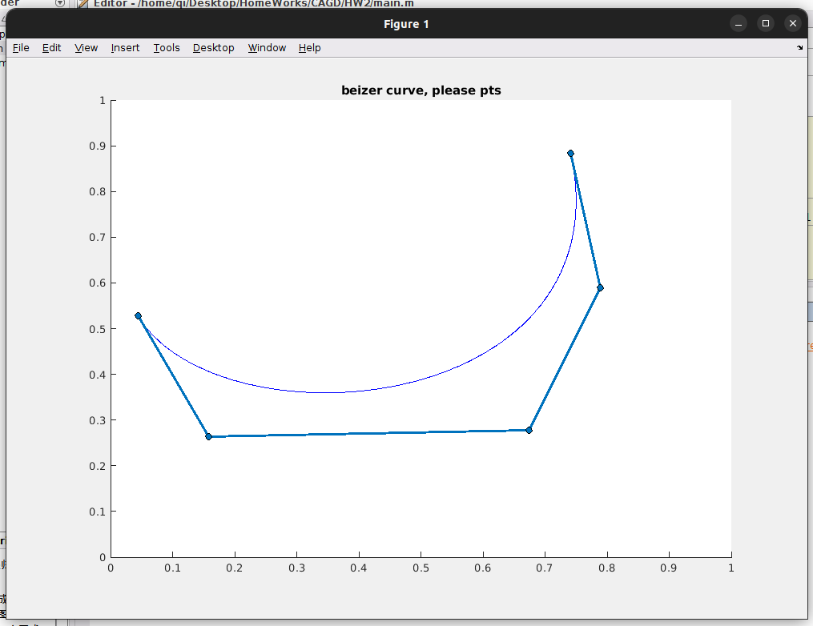

### 大作业： 实现递归Bezier 曲线生成以及控制多边形交互
#### 问题描述
对应CAGD的应用场景，需要很好的曲线族构造方法以逼近比较好的形状。Beizer曲线便是一族好的曲线。基于Beizer曲线的生成主要有两种方法：一种是基于Bronstein多项式，一种是基于线性组合递归实现。本次实验生成递归的。
#### 算法实现与分析
本次实验主要实现的Beizer的构造方法如下。

我们用一个数据$process$来表示递归中生成的项。
并且想要达到如下的交互

#### 结果展示
我实现的结果如下，
1. 实现任意点的画图

2. 实现实时地交互

#### 结果分析
此次实验的结果已经比较满意了，但是还需要更多的改进，对于格点的选取导致了对于点数过多时会十分影响交互（反应比较慢）但是如果是几个点的情形交互还是十分理想的。