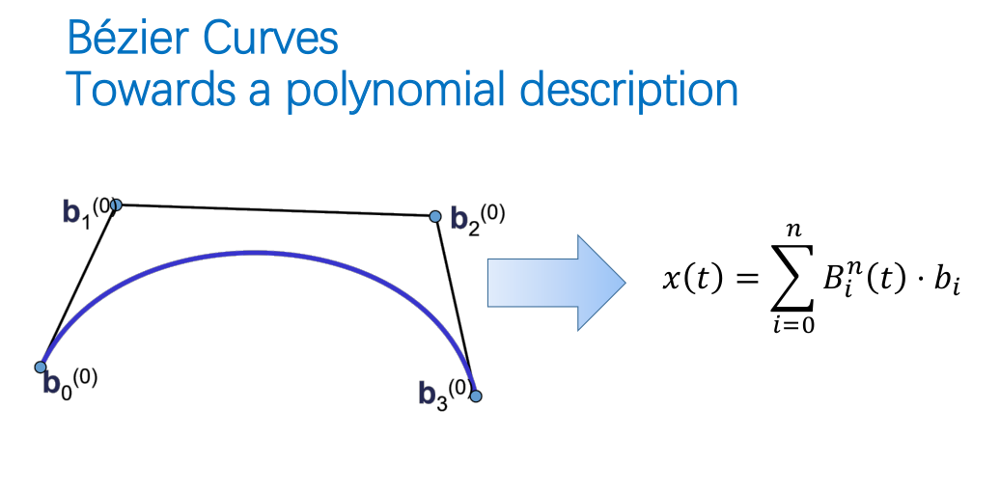
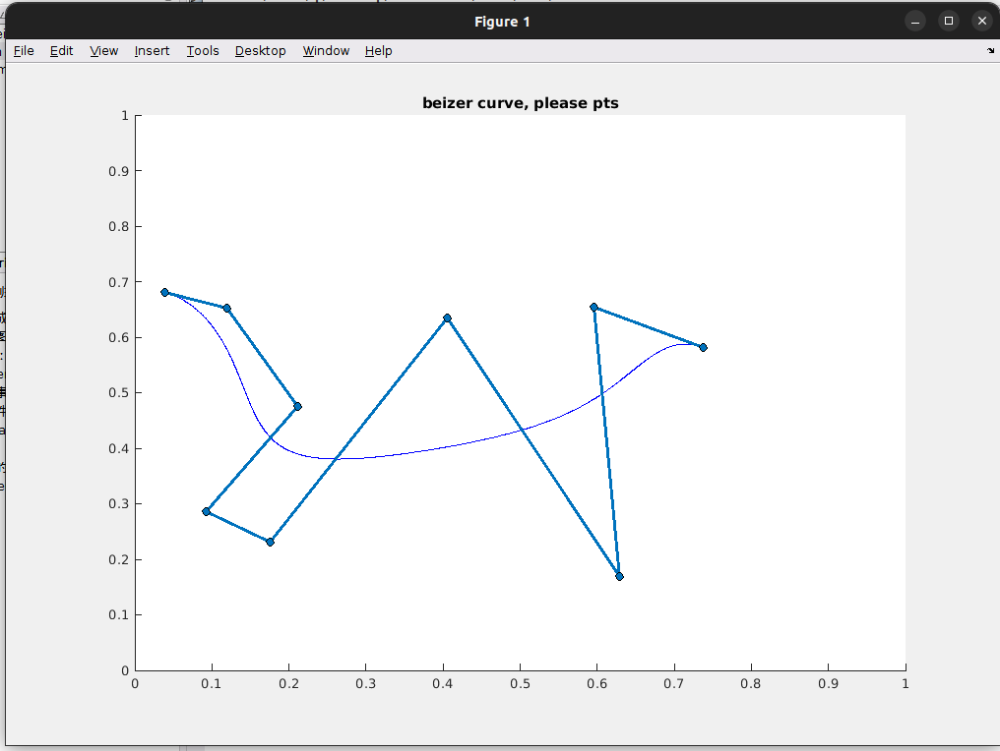
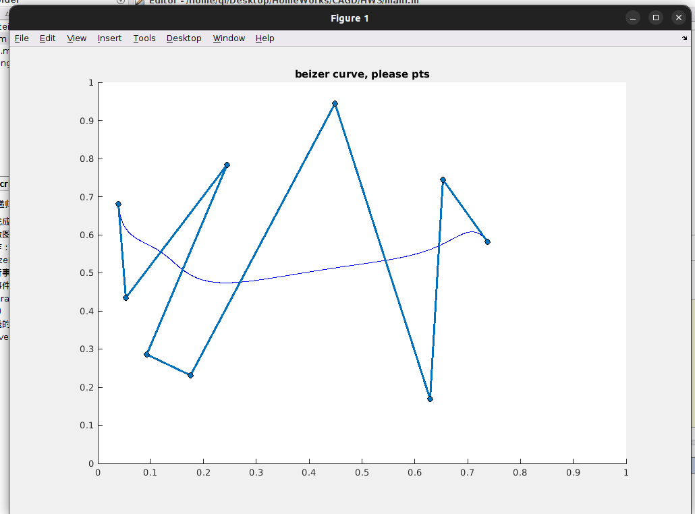
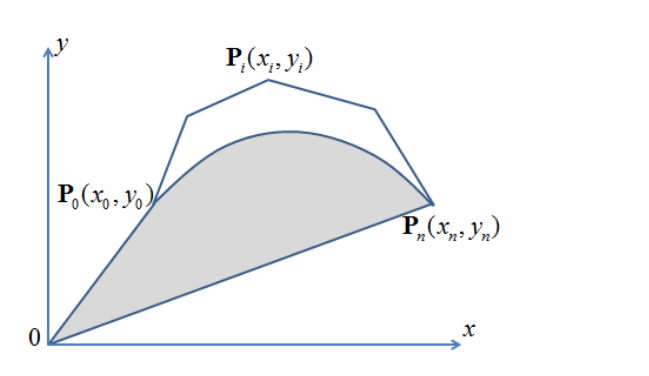

### 作业3： 实现基函数Bezier 曲线生成以及控制多边形交互
#### 问题描述
对应CAGD的应用场景，需要很好的曲线族构造方法以逼近比较好的形状。Beizer曲线便是一族好的曲线。基于Beizer曲线的生成主要有两种方法：一种是基于Bronstein多项式，一种是基于线性组合递归实现。本次实验生成基函数的。
#### 算法实现与分析
本次实验主要实现的Beizer的构造方法如下。

我们用一个函数来表示Bernstein基函数。
并且想要达到如下的交互

#### 结果展示
我实现的结果如下，
1. 实现任意点的画图

2. 实现实时地交互

#### 结果分析
此次实验的结果比上次已经比较满意了，得到比较好的交互结果，并且能对点数十分多的时候做到实时交互。

### 书面作业
2. 证明： Beizer曲线弧长不大于其控制多边形的周长.

证明： 考虑表达式，设为$P_i, i = 0, ...  , n$的Bezier曲线，则其表达式为
$$B(t) = \sum_{i=0}^n P_iB_n^i(t) $$
考虑求导即可
$$\frac{d B_n^i(x)}{dx} = n(B_{n-1}^{i-1}(x) - B_{n-1}^{i}(x))$$
所以
$$\frac{d B(t)}{dt} = \sum_{i=0} ^n P_i n(B_{n-1}^{i-1}(t) - B_{n-1}^{i}(t)) $$
(在多余处为0即可)。
故弧长为
$$S = \int_0^1 || \frac{d B(t)}{dt} || dt = \int_0^1 |\sum_{i=0} ^n P_i n(B_{n-1}^{i-1}(t) - B_{n-1}^{i}(t)) || dt$$
$$ = \int_0^1 ||\sum_{i=0} ^{n-1} n B_{n-1}^{i}(t) (P_i - P_{i+1}) || dt $$

$$ \le \sum_{i=0} ^{n-1} ||P_i - P_{i-1}|| \int_0 ^1 n  B_{n-1}^{i}(t)  dt $$
$$ \le  \sum_{i=0} ^{n-1} ||P_i - P_{i-1}|| = L(P_1, \cdots, P_n) $$
3. 圆弧不能用Beizer曲线精确表示.

证明： 若有可能表示出来，假设是有$n$个点组成的Beizer曲线，那么在$P$点处重合。

首先可知，在$P$点处，圆是无限可微的，有导数$f^{(i)}(P)$,并且由此给出Beizer曲线的控制点$P_i$(因为Beizer曲线的导数可以由控制点线性组合给出)

那么可以导出，圆弧是可以被多项式参数化的，即$f(t) = \sum_{i=0}^n P_i C_i^n(t)^i(1-t)^{n-i}$，但是这带入到圆面积的表达式中显然不成立。

4. 给出下面的面积表达式.

解：
考虑连线$P_0$和$P_n$,随后用参数化表示
$$B(t) = \sum_{i=0}^n P_iB_n^i(t) $$
$$L_{P_0P_n}(x) = y_0\frac{x - x_n}{x_0 - x_n} + y_n \frac{x_0 - x}{x_0 - x_n}$$
以及面积的剖分
$$S = S_{\triangle P_0OP_n} + S_n$$
$$S_{\triangle P_0OP_n} = |x_0 y_n - x_n y_0|/2$$
以及对于面积$S_2$：
$$S_2 = \int_0^1 |\sum_{i=0}^n y_iB_n^i(t) - L_{P_0P_n}(\sum_{i=0}^nx_iP_iB_n^i(t))| dt$$
后面就不好再继续算了，可以考虑绝对值永远为正/负的情况，同时也应该注意为负的时候可能会对$S_{\triangle}$产生冲突。