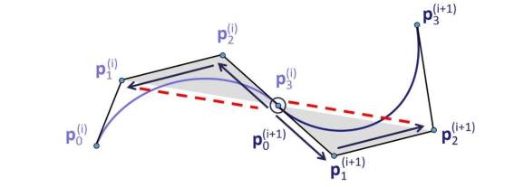

### 作业5
#### 1. 证明： 设$f(x) \in C^2[a,b]$是任意被插值函数， $S(x)$是自然插值三次样条函数。则有 
$$\int_a^b (S''(x))^2 dx \le \int_a^b (f''(x))^2 dx$$

证明： 令$g = f - S$ 则$g(t_i) = 0$ 对$\forall i \in (0, n)$成立，并且。
$$\int_a^b (f'')^2dx = \int_a^b (S'')^2 dx  + \int_a^b (g'')^2 dx + 2\int_a^b S''g'' dx $$

下面证明$\int_a^b S'' g'' dx \ge 0 $即可。
对于每个区间$[t_{i-1}, t_i]$,
$$\begin{align}\int_a^b S''g'' dx = &  \sum_{i=1}^n \int_{t_{i-1}}^{t_i} S''g'' dx \\
  = & \sum_{i=1}^n \left((S''g')(t_i) - (S''g')(t_{i-1}) - \int_{t_{i-1}}^{t_i} S'''g' dx \right) \\
   = & -\sum_{i=1}^n \int_{t_{i-1}}^{t_i} S''' g' dx = -\sum_{i=1}^n c_i \int_{t_{i-1}}^{t_i} g' dx \\
   = & -\sum_{i=1}^n c_i[g(t_i) - g(t_{i-1})]  = 0
  \end{align}$$
证毕。
#### 2. 证明：以下Beizer样条满足$C^2$连续，则有$\triangle P_1^{(i)} P_2^{(i)} P_3^{(i)}$和$\triangle P_0^{(i)} P_1^{(i)} P_2^{(i)}$

证明： 考虑在$P_0^{(i+1)} = P_3^{(i)}$点处左右两侧各阶导数分别为
$$B'_L(P_3^{(i)}) = C(P_2^{(i)} - P_3^{(i)}), B^{(2)}_L(P_3^{(i)}) =  C'(2 P_2^{(i)} - P_3^{(i)} - P_1^{(i)} )$$
$$B'_R(P_0^{(i+1)}) = C(P_1^{(i+1)} - P_0^{(i+1)}), B^{(2)}_R(P_0^{(i+1)}) =  C'(2 P_1^{(i+1)} - P_0^{(i+1)} - P_2^{(i+1)} )$$
所以合并即可：
$\vec {P_2^{(i)} P_3^{(i)} }= \vec {P_0^{(i+1)} P_1^{(i+1)}}$,
将二阶导条件合并并去掉一阶导条件可得，
$$\vec {P_1^{(i)} P_2^{(i)} }= \vec {P_1^{(i+1)} P_2^{(i+1)}}$$

直接为全等条件。
#### 3. 实现3次Beizer曲线交互生成.
答：结果如下

实现方法：
1. 构造参数，在前几次作业的框架基础上做改进
2. 对于输入的点集，构造方程，并且解之（类似于Laplacian方程的构造），然后将每一段插值。
3. 增加一些友好的用户交互。
4. TODO: 增加一些曲面的保存功能(以后的作业尽量用Qt来实现)。