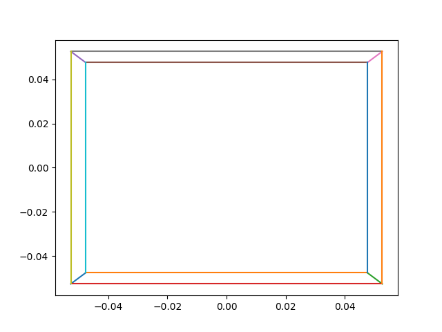
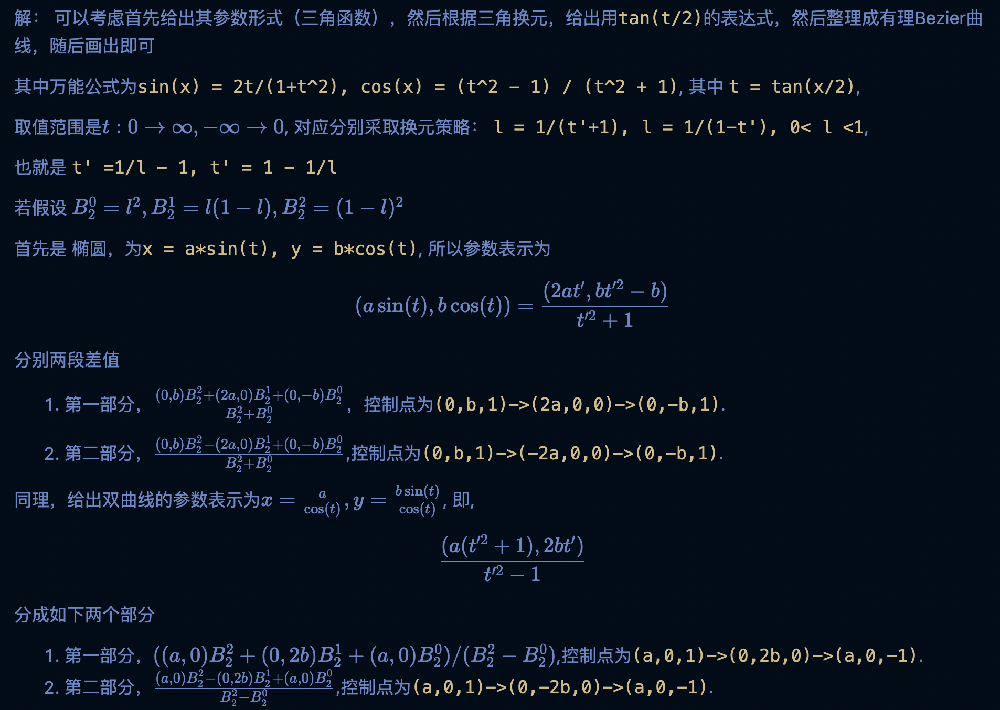
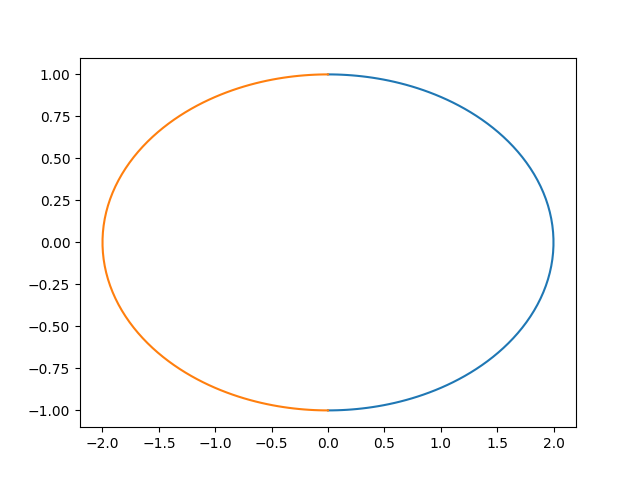
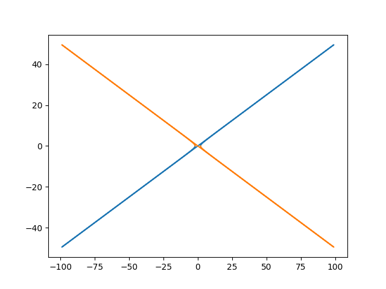
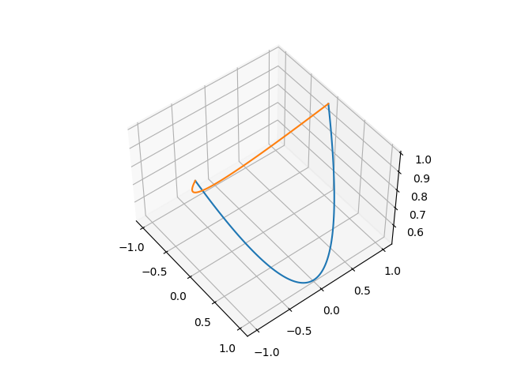
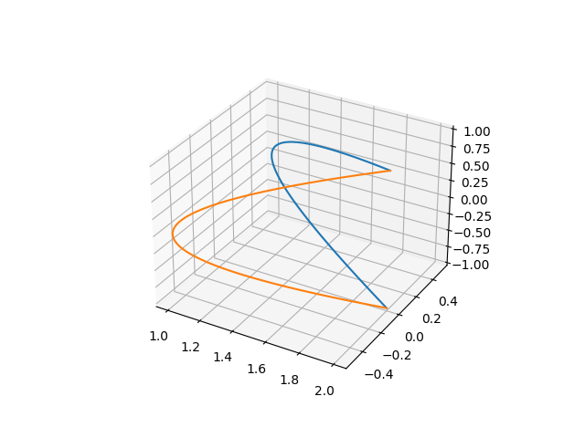

# 计算机辅助设计 作业8 
## PB19000093 张奇
## 1. 设计用户指定的 $2d$ 变长的正方形, `x`为中心的立方体，并自己设计相机内外参数，给出投影的结果

参考`OpenGL`的主要设置，我们设参考的相机外参为一个字典，主要是`position` 表示相机的位置，`lookat`表示相机所看的点，`headup`表示相机的`y`轴方向。
以及相机内参为`fx, fy`, 正方形的表示我们主要参考obj文件的方式，记录顶点和连接关系（即每一条边），render的过程用`matplot.pyplot.plot`模拟，并且能够呈现最终的结果如下(具体实现可以参考代码)
(此处参数为相机在(-10,0,0),头朝y轴，正方体在(0,0,0)为中心，d=0.5的情形,其中相机内参均为1)

## 2. 用有理Bezier样条表示圆锥曲线`x^2/a^2 + x^2/b^2 = 1`(椭圆)， 和`x^2/a^2 - x^2/b^2 = 1`(双曲线)

那么，由理论可以给出画出来的结果如下(用到了两组参数表示)

以及

(可能对于双曲线，这样做不是很好吧)
## 3.将上一问的在三维空间中表示出来
画出来的结果如下（更多的交互展示请运行代码`main2.py`,其中依赖项为`pip install matplotlib numpy`）
首先是椭圆的结果

其次是双曲线的结果

（上面的结果均从a=2,b=1给出）。