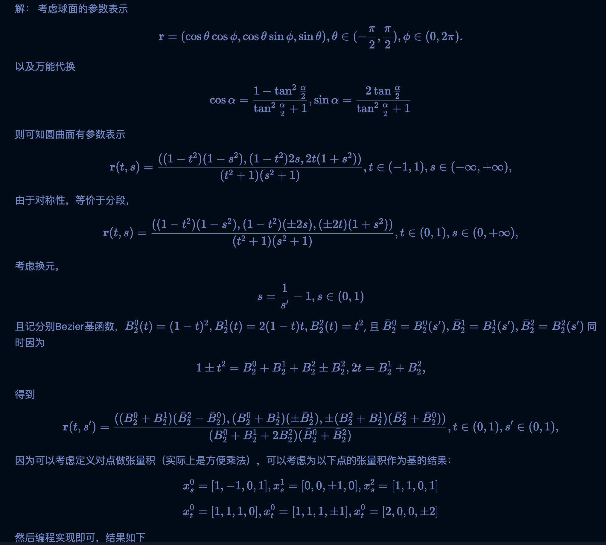
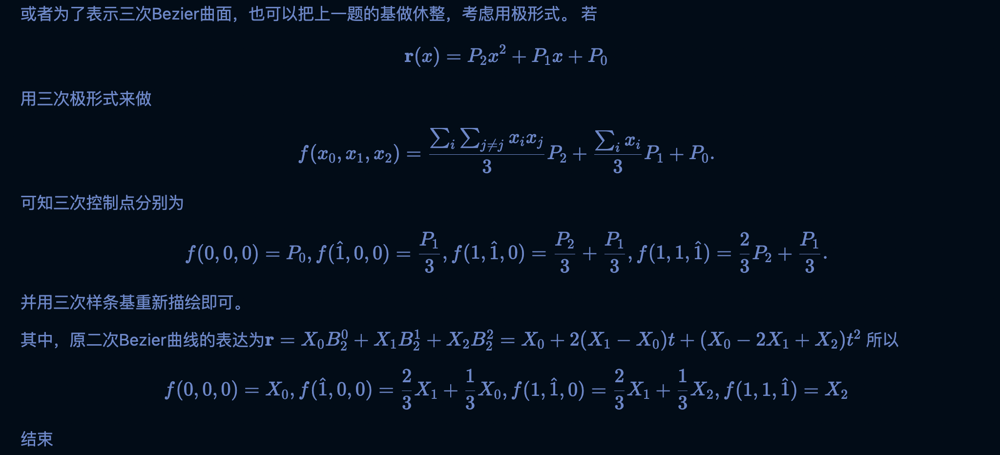
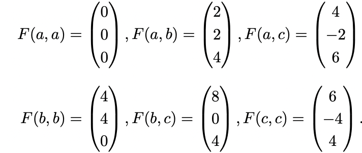

# CAGD 作业 HW9
##### Warning: 本代码的依赖项为 `pip install numpy polyscope` ,基于Python.
## 1. 把球面用二次有理Bezier曲面分段表示出来
解：

然后编程实现即可，结果如下


## 2. 把椭圆$3x^2+2y^2+z^2=1$用双三次有理Bezier曲面表示
解：
 如果用第一题中的表达方式，修改参数即可, 结果如下。


其刻画结果如下

## 3. 某二次Bezier三角形有顶点参数坐标`a = (0,0), b = (1,0 ), c = (0.5, 1)`以及一下控制点

问：在`P1=(0.25, 0.5), P2 = (0.3, 0.75), P3 = (0.5, 0.5)`三个参数之间，讨论在三角形内外性，对在内次参数，计算其坐标。

解：

首先，直接讨论这些点是否在参数三角形内部即可，其中参数三角形的顶点为别为`a = (0,0), b = (1,0 ), c = (0.5, 1)`


可以直接知道，P1在三角形的左侧内部，P2在三角形左侧外部，P3在三角形的高上。
并且可以计算它们的重心坐标分别为
通过代码
```python
import numpy as np
def coord(x):
    a = np.array([0,0])
    b = np.array([1,0])
    c = np.array([0.5,1])
    x = np.array(x)
    xa = a - x
    xb = b - x
    xc = c - x
    sa = np.abs(np.cross(xb,xc))
    sb = np.abs(np.cross(xa,xc))
    sc = np.abs(np.cross(xa,xb))
    return np.array([sa, sb, sc]) / (sa+sb+sc)
```
可以直接计算重心坐标为`[0.5, 0, 0.5], [0.25, 0.25, 0.5]`
所以可以计算
```
P1 = F(a,a) (0.5)^2 + F(a,c)2*0.5*0.5+ F(c,c)(0.5)^2 = (3.5, -2, 4)
P3 = F(a,a) 0.25*0.25 + F(b,b) * 0.25 * 0.25 + F(c,c) * 0.5 * 0.5 + F(a,b) * 2 * 0.25 * 0.25 + F(a,c) * 2 * 0.25 * 0.5 + F(b,c) * 2 * 0.25 * 0.5 = [5, -1, 4]
```