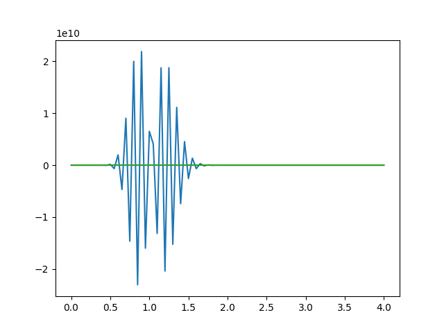

# 数值PDE实验： 方程色散性
## 问题描述

## 算法实现
对于该问题，首先注意`FTBS`，`FTCS`，`Lax-Werndroff`格式分别为
```c
u[n+1][j+1] = u[n][j]+dt/dx*(u[n][j+1]-u[n][j])
u[n+1][j+1] = u[n][j]+dt/dx*(u[n][j+1]-u[n][j-1])/2
u[n+1][j+1] = u[n][j]+dt/dx*(u[n][j+1]-u[n][j-1])/2+dt*dt/2*(u[n][j+1]+u[n][j-1]-2*u[n][j]) /(dx*dx);
```
在具体实现上，因为仅仅需要求解最终的结果，不需要中间过程，所以只需要设立中间数据，一直迭代即可。以及考虑中间依赖项，就需要增加初始区间。

对于`FTCS`和`LaxW`算法，可知`nx`个最终解，需要`nx+2nt`个对称的初始数据(`FTCS, LaxW`), 而对于`FTBS`算法，需要`nx+nt`个解。

而区间若为`nx`个，则上述计算需要用`nx+1`来替换`nx`

以及对于迭代过程，应该需要坐改进：`u[n][j] => u[n][j-n]`(因为不存储那么多数据)，同时因为是在迭代过程中，也不需要计算那么多项。

实验环境： 

C++ 产生数据

`OSX 12, clang++ -std=C++11`(在该目录下执行`make`即可编译，并执行产生数据)

主函数会运行并生成满足题目需求的数据（解区间均为`[0,4]`），并以`python` 文件到形式存储到相应的文件中。

python 画图

C++会把数据生成到`.py`文件中，python来读文件并画图。
依赖项 `pip install matplotlib`即可。

## 结果展示

> FTBS格式，t=0.05,dt: 0.01(blue) vs 0.04(red) 
<center>  </center>

> FTBS格式，t=0.20,dt: 0.01(blue) vs 0.04(red) 
<center>  </center>

> FTBS格式，t=0.80,dt: 0.01(blue) vs 0.04(red) 
<center>  </center>

> FTBS格式，t=3.20,dt: 0.01(blue) vs 0.04(red) 
<center>  </center>


> FTCS格式，t=0.05,dt: 0.01(blue) vs 0.04(red) 
<center>  </center>

> FTCS格式，t=0.20,dt: 0.01(blue) vs 0.04(red) 
<center>  </center>

> FTCS格式，t=0.80,dt: 0.01(blue) vs 0.04(red) 
<center>  </center>

> FTCS格式，t=3.20,dt: 0.01(blue) vs 0.04(red) 
<center>  </center>


> LaxW格式，t=0.05,dt: 0.01(blue) vs 0.04(red) 
<center>  </center>

> LaxW格式，t=0.20,dt: 0.01(blue) vs 0.04(red) 
<center>  </center>

> LaxW格式，t=0.80,dt: 0.01(blue) vs 0.04(red) 
<center>  </center>

> LaxW格式，t=3.20,dt: 0.01(blue) vs 0.04(red) 
<center>  </center>

> 横向比较 t=0.05, dt = 0.01时 (FTBS(blue),_FTCS(red),_LaxW(green)
<center>  </center>

> 横向比较 t=0.05, dt = 0.04时 (FTBS(blue),_FTCS(red),_LaxW(green)
<center>  </center>

> 横向比较 t=0.20, dt = 0.01时 (FTBS(blue),_FTCS(red),_LaxW(green)
<center>  </center>
上面有影响者，重新绘制 FTCS(blue),_LaxW(red)
<center>

</center>

> 横向比较 t=0.20, dt = 0.04时 (FTBS(blue),_FTCS(red),_LaxW(green)
<center>  </center>

上面有影响者，重新绘制， FTCS(blue),_LaxW(red)

<center>

</center>


> 横向比较 t=0.80, dt = 0.01时 (FTBS(blue),_FTCS(red),_LaxW(green)
<center>  </center>

上面有影响者，重新绘制, FTCS(blue),_LaxW(red)

<center>

</center>


> 横向比较 t=0.80, dt = 0.04时 (FTBS(blue),_FTCS(red),_LaxW(green)
<center>  </center>

上面有影响者，重新绘制 FTCS(blue),_LaxW(red)

<center></center>

> 横向比较 t=3.20, dt = 0.01时 (FTBS(blue),_FTCS(red),_LaxW(green)
<center>  </center>

上面有影响者，重新绘制 FTCS(blue),_LaxW(red)
<center>

</center>


> 横向比较 t=3.20, dt = 0.04时 (FTBS(blue),_FTCS(red),_LaxW(green)

<center>  </center>

上面有影响者，重新绘制,FTCS(blue),_LaxW(red)
<center>

</center>

## 分析总结
首先根据结果的经验分析可知：
1. 时间上的迭代次数越多，解越不稳定。
2. 数值解的稳定性和初始值的连续性有很大关系（我们初始值不连续会产生非常混乱的结果）
3. 稳定性上： `FTBS` < `FTCS` < `LaxW`。


### 结合结果分析
可知，应为FTCS格式和LaxW格式均为耗散的，所以其结果的振幅是减小的。并且应为其色散性，在结果中也展示出了比较大的误差。

（抱歉本程序在编写的时候没有发现方程和程序有问题，应该全部取负号）。